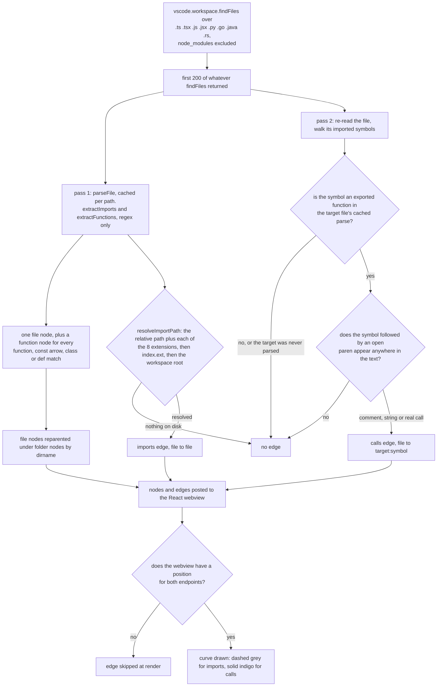

# Repomap

A VS Code panel that renders the open workspace as a dependency graph you can click
through, and puts an AI explanation of any file one right-click away.

Built at the IBM Bob Hackathon with Team PRIMATES, where it won **Best Use of IBM Bob**.

## What the graph actually is

`dependencyService.ts` walks the workspace and emits two kinds of edge:

| Edge | How it is found |
|---|---|
| `imports` | ES6 `import ... from './x'` and `const x = require('./x')` for TS/JS, and Python's `import` / `from ... import`, resolved against the workspace and retried across the supported extensions when the path is extensionless |
| `calls` | For each symbol a file imports, a scan of the importing file for `symbol(` |

Nodes come in three types, `folder`, `file` and `function`, so the same view collapses
from directory structure down to individual exported functions.

**This is regex extraction, not a parser, and it is worth being clear about what that
costs.** A `calls` edge means the imported symbol's name appears followed by an open
paren, so a mention in a comment or a string counts. Import parsing is implemented for
TypeScript, JavaScript and Python; `.go`, `.java` and `.rs` files are discovered and
placed as nodes, but their imports are not read, so those nodes are sparser than they
should be. The walk stops at 200 files to keep the panel responsive, which truncates
large repos rather than sampling them.

Good enough to orient yourself in an unfamiliar repo in a few seconds. Not good enough
to answer "is this function dead".

## The AI side

`bobService.ts` shells out to the IBM Bob CLI in one-shot mode, writing the prompt to a
temp file rather than passing it as an argument. Three things hang off it: a two-sentence
explanation of a selected file, a chat about that file, and an edit proposal you can
apply to the buffer from the panel.

**Bob's CLI is a hard dependency for every AI feature.** The graph, the file tree and the
navigation all work without it; explanations and chat do not.

## From files to edges

Two passes over the same file list, and an edge only survives if every step below resolves.



That last check has two consequences. An `imports` edge is emitted whenever the target
exists on disk, so a file past the 200 cap gets an edge pointing at a node that was never
created and the webview silently drops it. And function nodes are only given positions
when you expand their file, so `calls` edges stay invisible until you click the file open.

## Run it

Needs Node 18+, VS Code 1.85+, and the IBM Bob CLI installed and authenticated if you
want the AI features.

```bash
git clone https://github.com/lgoyal6/RepoMap.git
cd RepoMap
make run
code --install-extension extension/repomap-vscode-1.0.0.vsix
```

`make run` installs both workspaces, builds the React webview with Vite, compiles the
extension, and packages the `.vsix`. `make full-run` does the same after clearing
`node_modules` and both `dist/` directories.

Then open a workspace and run **Repomap: Open Panel** from the command palette.

## Layout

| Path | What |
|---|---|
| `extension/src/dependencyService.ts` | The graph builder described above, 434 lines and the substance of the project |
| `extension/src/bobService.ts` | Bob CLI wrapper |
| `extension/src/webviewProvider.ts` | Panel lifecycle and the message bridge to the webview |
| `extension/src/fileSystemService.ts` | Workspace reads, writes and renames |
| `webview/` | React 18 and Vite panel: SVG graph with pan and zoom, file tree, chat |

Debugging notes, including how to attach to the extension host, are in
[`DEBUGGING_GUIDE.md`](DEBUGGING_GUIDE.md).
